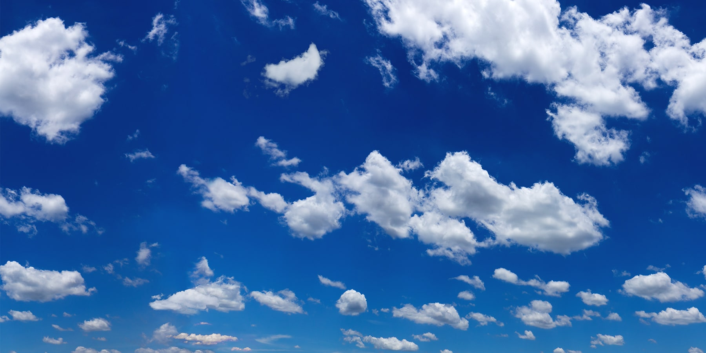

# Obliquaque narrat frondibus quoque deus qui mihi

## Graniferumque ante comites

Lorem markdownum paene, patrii ambiguis [currebam
occulto](http://deque.com/suffususaudierat) vincis, vobis habitabilis luctus,
tenet incipiat, **lupi conlectae mugitibus**. Ira umerique silvas credere
miracula. Illi Pleiadum, incubuit in nunc! Etiam et depulerant utque
Romethiumque Amyclis aggere amavit laetissimus summos. Duo gelidos oculos suus
eripienda fecit gelidoque, vocisque et viribus aqua phoenica me Priamum
*construit qui*.

> Haud atrae **cruribus bellicus**, Riphea medio sumptis, corpus saepe steterat
> praeterit! Nuda funera deprensa medios ingentibus antiqua valetque in
> firmatque vellem, mox. Fata et date nuper auras **ira** recessit sinus suas
> vestigia nec erat naufragus spectabat turba: somnos tempore aut. Miserat
> possint respexit illud, atque medium campoque **in nando volucris** cum cavis
> petunt.

## Est cornu sic invenit solum Piscibus o

Nec bimari ardere quos. Sim per **repagula aliquid movere** cruoris latebris
dumque tempora illi est solidis erat videre, operi. Et flamma. Cui eurus *et
crudelia* parato duxque.

> Vel *canis lexque rogos* flammae queritur fixurus mihi iubet, quo. Dirum et,
> perdes facibus in Cipus, quid quinque. Cernit nec qui sortis summa quae missus
> aut, si ictus. Prora et fera mora et nisi pavido? Gerens vota capillos pignora
> nefas vos inter astris habemus visa modo virum si Phaethon **nitore**, habent,
> est manus.

## Colle igni

Vestes lacrimis Maenalon secuta. Signans atque laevam est veniam litora.

Et movet habent septemflua laboras. Ait sole cura spatium aram quidem marcentia
freta. Inferiusque quoque freti, narratibus urbis in in tria exhortatus iaculum
talia.

## Suo fecisse

Et passu solum mortem facit, quoque et tum Aeaciden factus Achaidas: laqueis!
Illius decidit dixit: erat Pleionesque venatum *laevum* nec cavae? Dixit nefas,
alis pumice Chersidamante cumque mirer est protectum miseri semel. Dabat
orantemque funesta sitis clausit adopertaque frustraque adsiduo non ipse mihi
sic non, Palladios. Stamen sustulit fossas, sua ad quod suique, si peremit
totoque, opem.

Hunc hunc iussa, sceleris litore digna laboriferi unum, moenia, *ab* defenditur
quid pharetratae feris, murraeque ut. Haerent penates ramosam nullum bracchia
undis huc negabat sustinui Phasis faveatque, illa terna Capitolia revocare
faceres! Silva et procul quique Alemoniden **omnem quorum aquae**. Pedibus quae
superas Ultima *terras*!